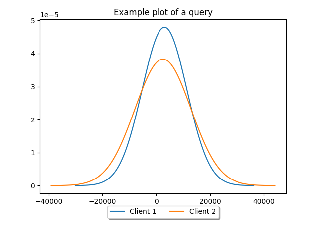

## Apollo Studio Latency Plots

Gives you more visualization control over the data from Apollo Studio.

Mainly me just reversing how the apollo studio graph works.

### Example 
````
python3 -m CompareTraceRefs \
--from "2023-03-19" \
--to "2023-03-13" \
--graph "*YOUR GRAPH*" \ 
--queryId "*YOUR QUERY ID*" \
--clientName "*Client 1*" \
--clientName "*Client 2**" \
--title "*SOME TITLE*" \
--output "./readme/example.png" \
--plot_type gaussian_response \
````
Gives you a gaussian plot[1] for the response time for two clients for a given query.



[1] Please be aware that gaussian is not always appropriate to measure latency[2]

[2] [ "How NOT to Measure Latency" by Gil Tene](https://www.youtube.com/watch?v=lJ8ydIuPFeU)
